<div align="center">
  
  <h1 align="center">Unicorn-Pi</h1>
  <p align="center">
    A software suite of the best LED effects and animations for the Raspberry Pi Pico with the Pimoroni Unicorn Pack. Changing to the next or previous view is as simple as pressing the "A" or "X" button on the Unicorn Pack, and the previously selected view will always be saved and loaded on every reboot.
  </p>
  <p align="center">
    The scripts used in this software are written in Python and are designed to be easy to use, individually modify, and test. Suggestions for new effects or animations are always welcome, & thank you for checking out this project!
  </p>
</div>

## Index <a name="index"></a>

- [Build Status](#build-status)
- [Parts List](#parts-list)
- [Previews](#previews)
- [Software Setup](#software-setup)
- [Software Guide](#software-guide)
- [Development](#development)
- [Licensing](#licensing)
- [Wrapping Up](#wrapping-up)

<!---------------------------------------------------------------------------->
<!---------------------------------------------------------------------------->
<!---------------------------------------------------------------------------->

## Build Status <a name="build-status"></a>

[](https://github.com/CodyTolene/Unicorn-Pi/actions/workflows/lint.yml)

<p align="right">[ <a href="#index">Index</a> ]</p>

<!---------------------------------------------------------------------------->
<!---------------------------------------------------------------------------->
<!---------------------------------------------------------------------------->

## Parts List <a name="parts-list"></a>

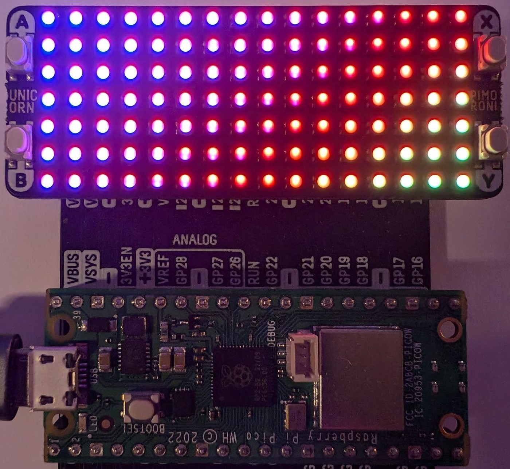

| Part                                      | Price (USD) |
| :---------------------------------------- | :---------- |
| [Raspberry Pi Pico][url-pi-pico]          | $15.00      |
| [Pimoroni Unicorn Pack][url-unicorn-pack] | $24.00      |

<p align="right">[ <a href="#index">Index</a> ]</p>

<!---------------------------------------------------------------------------->
<!---------------------------------------------------------------------------->
<!---------------------------------------------------------------------------->

## Previews <a name="previews"></a>

| Name              | Preview |
| :---------------- | :---------------------------------------------------------------- |
| Digital Clock     |        |
| Digital Rain      |          |
| DVD Bouncer       | 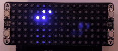           |
| Emergency         | 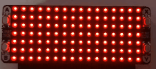               |
| Fire              |                          |
| Fireflies         | 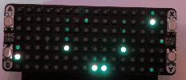               |
| Fireplace         |                |
| Fireworks         | 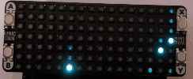               |
| Flashlight Torch  | 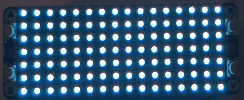 |
| Lava Lamp         |                |
| Lightning         | 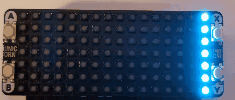               |
| Plasma            | 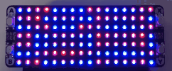                     |
| Rainbow (default) | 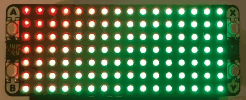                   |
| Raindrops         |                |
| SOS (Morse Code)  | 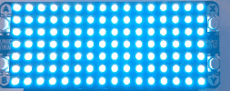                           |
| Snowfall          | 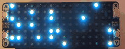                 |
| Warp Speed        |              |
| Wave              | 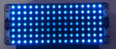                         |

Have another idea? Share it [here][url-new-issue]. You can also fork this repo and submit a pull request with your own effect or animation! I'd love to see what you come up with.

<p align="right">[ <a href="#index">Index</a> ]</p>

<!---------------------------------------------------------------------------->
<!---------------------------------------------------------------------------->
<!---------------------------------------------------------------------------->

## Software Setup <a name="software-setup"></a>

First make sure you have this repo cloned to your computer. If you don't have Git installed, you can download the repo as a ZIP file by clicking the green "Code" button at the top of this page. Follow the steps below to run the Python scripts in this repository on your Raspberry Pi Pico with the Pimoroni Unicorn Pack:

1. Install the Pimoroni custom software to your Raspberry Pi Pico by following the [official guide][url-pimoroni-pico-guide].
2. Download and install the Thonny IDE from the [official website][url-thonny]. 
   > ![Info][img-info] This allows us to write and run Python code on the Raspberry Pi Pico.
3. Open Thonny and connect your Raspberry Pi Pico to your computer using a USB cable.
4. On the left hand side you should see the file explorer for your Raspberry Pi Pico. Drag and drop all the files from the `scripts` folder in this repository to the root directory of your Raspberry Pi Pico.
5. Unplug and replug your Raspberry Pi Pico to restart the device.

The file `main.py` will automatically run when the Raspberry Pi Pico is powered on.

<p align="right">[ <a href="#index">Index</a> ]</p>

<!---------------------------------------------------------------------------->
<!---------------------------------------------------------------------------->
<!---------------------------------------------------------------------------->

## Software Guide <a name="software-guide"></a>

Button layout

```bash
|==================================|
| (A) oooooooooooooooooooooooo (X) |
|     oooooooooooooooooooooooo     |
| (B) oooooooooooooooooooooooo (Y) |
|==================================|
```

| Button | Action          |
| :----- | :-------------- |
| "A"    | Previous view.  |
| "X"    | Next view.      |
| "B"    | Nothing (yet).  |
| "Y"    | Nothing (yet).  |

<p align="right">[ <a href="#index">Index</a> ]</p>

<!---------------------------------------------------------------------------->
<!---------------------------------------------------------------------------->
<!---------------------------------------------------------------------------->

## Development <a name="development"></a>

1. Make sure you have Python installed on your computer (3.8+). You can download Python from the [official website][url-python-downloads]. 

2. Run the following in a terminal at the root of this repository to install development dependencies:

```bash
# Install the required packages
python3 -m pip install -r requirements.txt
# Install the pre-commit hooks
pre_commit install
# Update the pre-commit hooks
pre_commit autoupdate
```

> ![Info][img-info] To run the formatter explicitly, use `python3 -m black scripts/`

> ![Info][img-info] To run the linter explicitly, use `python3 -m flake8 --show-source --ignore E501 scripts/`

3. Make your changes, test using Thonny.

4. Run the linting and formatting tools:

```bash
# Linting
python3 -m flake8 --show-source --ignore E501 .
# Formatting
python3 -m black .
```

5. Submit a pull request with your changes.

<p align="right">[ <a href="#index">Index</a> ]</p>

<!---------------------------------------------------------------------------->
<!---------------------------------------------------------------------------->
<!---------------------------------------------------------------------------->

## Licensing <a name="licensing"></a>

This project is licensed under the Apache License, Version 2.0. See the [APACHE_2_LICENSE](LICENSE) file for the pertaining license text.

`SPDX-License-Identifier: Apache-2.0`

<p align="right">[ <a href="#index">Index</a> ]</p>

<!---------------------------------------------------------------------------->
<!---------------------------------------------------------------------------->
<!---------------------------------------------------------------------------->

## Wrapping Up <a name="wrapping-up"></a>

Thanks to all the people and projects that made this possible! I hope you enjoy this project as much as I enjoyed working on it. If you have any questions, please let me know by opening an issue [here][url-new-issue].

| Type                                                                      | Info                                                                      |
| :------------------------------------------------------------------------ | :------------------------------------------------------------------------ |
|                 | webmaster@codytolene.com                                                  |
|      | https://www.buymeacoffee.com/codytolene                                   |
|  | [bc1qfx3lvspkj0q077u3gnrnxqkqwyvcku2nml86wmudy7yf2u8edmqq0a5vnt][url-btc] |

Fin. Happy programming friend!

Cody Tolene

<!---------------------------------------------------------------------------->
<!---------------------------------------------------------------------------->
<!---------------------------------------------------------------------------->

<!-- IMAGE REFERENCES -->

[img-info]: .github/images/ng-icons/info.svg
[img-warning]: .github/images/ng-icons/warn.svg

<!-- LINK REFERENCES -->

[url-btc]: https://explorer.btc.com/btc/address/bc1qfx3lvspkj0q077u3gnrnxqkqwyvcku2nml86wmudy7yf2u8edmqq0a5vnt
[url-new-issue]: https://github.com/CodyTolene/Unicorn-Pi/issues/new
[url-pi-pico]: https://www.raspberrypi.org/products/raspberry-pi-pico/
[url-pimoroni-pico-guide]: https://learn.pimoroni.com/tutorial/pico/getting-started-with-pico
[url-python-downloads]: https://www.python.org/downloads/
[url-thonny]: https://thonny.org/
[url-unicorn-pack]: https://shop.pimoroni.com/products/pico-unicorn-pack

<!---------------------------------------------------------------------------->
<!---------------------------------------------------------------------------->
<!---------------------------------------------------------------------------->
