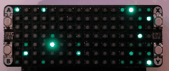
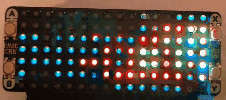
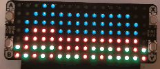
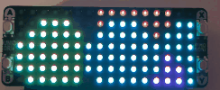
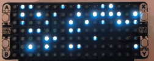

  
  <h2 align="center">Unicorn-Pi</h2>
  

    A simple guide to setting up a Raspberry Pi Pico with the Pimoroni Unicorn Pack, including the best LED effects and animations!
  

## Index 

- [Parts List](#parts-list)
- [Previews](#previews)
- [Setup](#setup)
- [Licensing](#licensing)
- [Wrapping Up](#wrapping-up)

<!---------------------------------------------------------------------------->
<!---------------------------------------------------------------------------->
<!---------------------------------------------------------------------------->

## Parts List 

| Part                                      | Price (USD) |
| :---------------------------------------- | :---------- |
| [Raspberry Pi Pico][url-pi-pico]          | $15.00      |
| [Pimoroni Unicorn Pack][url-unicorn-pack] | $24.00      |

[ <a href="#index">Index</a> ]

<!---------------------------------------------------------------------------->
<!---------------------------------------------------------------------------->
<!---------------------------------------------------------------------------->

## Previews 

| Name                                                        | Preview |
| :---------------- | :---------------------------------------------------------------- |
| Digital Clock     |        |
| Digital Rain      |          |
| DVD Bouncer       |            |
| Emergency         |                |
| Fire              |                          |
| Fireflies         |                |
| Fireplace         |                |
| Fireworks         |                |
| Flashlight Torch  |  |
| Lava Lamp         |                |
| Lightning         |                |
| Plasma            |                      |
| Rainbow (default) |                    |
| Raindrops         |                |
| SOS (Morse Code)  |                            |
| Snowfall          |                  |
| Warp Speed        |              |
| Wave              |                          |

[ <a href="#index">Index</a> ]

<!---------------------------------------------------------------------------->
<!---------------------------------------------------------------------------->
<!---------------------------------------------------------------------------->

## Setup 

...

[ <a href="#index">Index</a> ]

<!---------------------------------------------------------------------------->
<!---------------------------------------------------------------------------->
<!---------------------------------------------------------------------------->

## Licensing 

This project is licensed under the Apache License, Version 2.0. See the [APACHE_2_LICENSE](LICENSE) file for the pertaining license text.

`SPDX-License-Identifier: Apache-2.0`

[ <a href="#index">Index</a> ]

<!---------------------------------------------------------------------------->
<!---------------------------------------------------------------------------->
<!---------------------------------------------------------------------------->

## Wrapping Up 

Thanks to all the people and projects that made this possible! I hope you enjoy this project as much as I enjoyed working on it. If you have any questions, please let me know by opening an issue [here][url-new-issue].

| Type                                                                      | Info                                                                      |
| :------------------------------------------------------------------------ | :------------------------------------------------------------------------ |
|                 | webmaster@codytolene.com                                                  |
|      | https://www.buymeacoffee.com/codytolene                                   |
|  | [bc1qfx3lvspkj0q077u3gnrnxqkqwyvcku2nml86wmudy7yf2u8edmqq0a5vnt][url-btc] |

Fin. Happy programming friend!

Cody Tolene

<!---------------------------------------------------------------------------->
<!---------------------------------------------------------------------------->
<!---------------------------------------------------------------------------->

<!-- IMAGE REFERENCES -->

[img-info]: .github/images/ng-icons/info.svg
[img-warning]: .github/images/ng-icons/warn.svg

<!-- LINK REFERENCES -->

[url-btc]: https://explorer.btc.com/btc/address/bc1qfx3lvspkj0q077u3gnrnxqkqwyvcku2nml86wmudy7yf2u8edmqq0a5vnt
[url-new-issue]: https://github.com/CodyTolene/Unicorn-Pi/issues/new
[url-pi-pico]: https://www.raspberrypi.org/products/raspberry-pi-pico/
[url-unicorn-pack]: https://shop.pimoroni.com/products/pico-unicorn-pack

<!---------------------------------------------------------------------------->
<!---------------------------------------------------------------------------->
<!---------------------------------------------------------------------------->
